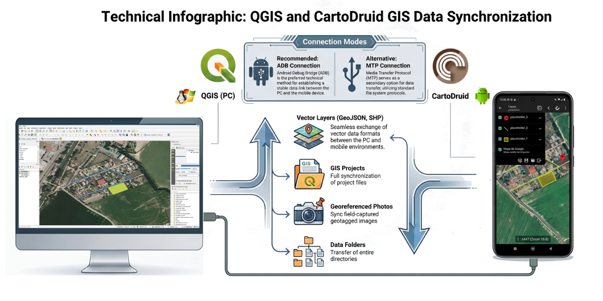
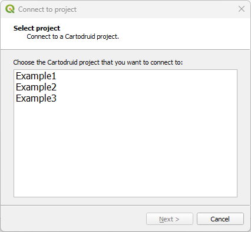
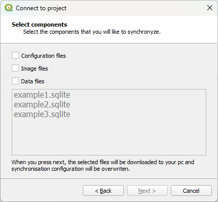
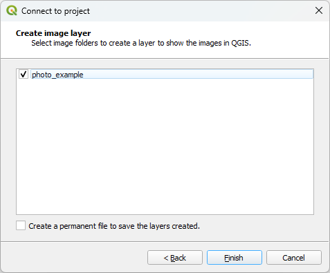
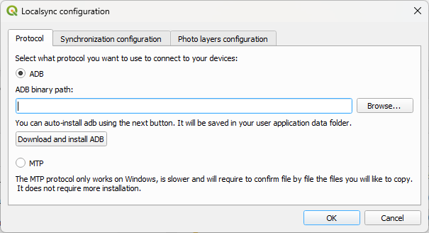
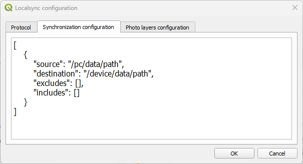
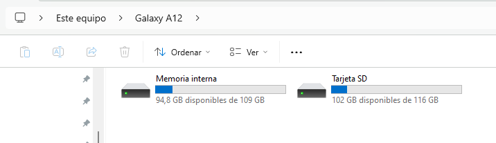

# QGIS Plugin to synchronize files between a device and a QGIS project.

CartoDruid Device Sync is a **QGIS plugin** designed to synchronize files between a **PC** and one or more **mobile devices**.
It enables fast and efficient data exchange between **QGIS projects** and the fieldwork tool **CartoDruid, without relying on cloud services**.

Although focused on **CartoDruid projects**, the plugin is **data-agnostic** and can be used to synchronize any folder structure between a mobile device and a PC.
For the time being, the plugin is fully functional on Windows and partially functional on Linux (Only ADB protocol works on Linux).

Communication is performed via:

- **ADB (Android Debug Bridge)** as the primary transport protocol, currently working only via USB cable.
- **MTP (Media Transfer Protocol)** as a fallback when ADB is not available.

Key features:

- **Automatic detection of CartoDruid projects**: scans device storage to locate projects and generate synchronization settings.
- **Project configuration synchronization**: copies and updates CartoDruid project configuration files.
- **Vector data synchronization**: synchronizes vector layers and automatically adds them to the QGIS Table of Contents (**TOC**).
- **Georeferenced image synchronization**: transfers images from the device and imports them as geo-tagged photo layers.
- **Generic folder synchronization**: allows synchronization of any folder between device and PC, not limited to CartoDruid data.

This plugin enables teams to synchronize field data locally without relying on cloud services, allowing multiple technicians to collaborate efficiently through a central office PC.



## How to use it

To load the plugin you have 3 options:
- Search in the QGIS plugin repository for CartoDruid Device Sync and install it from there.
- Create a symlink of the qgis-plugin folder (located inside src) in your QGIS python plugin folder.
- Execute the create_zip.py `python create_zip.py` that is in the path /src/qgis-plugin. This will create a folder called build
with a zip that you can load on QGIS as a plugin.


This is the toolbar of the plugin. The buttons from left to right do the following:
- Down arrow: Download the files from the device folder and using the filters indicated on the configuration.
- Up arrow: Upload the files from the pc folder and using the filters indicated on the configuration.
- Combo box: Search for the connected devices using the selected protocol and shows them to you so you can select with what
device the communication will be.
- Gears: Open the configuration menu.
- Cartodruid folder: Open the Cartodruid Synchronization Wizard.

The easiest way to configure de synchronization is using the Cartodruid Synchronization Wizard.
If you don't use Cartodruid then go to the [Configuration menu section](#configuration-menu).

### Fast connection to a Cartodruid Project.

The fastest and easiest way to connect to a Cartodruid Project using the plugin is the following:

1. Create a new QGIS project and save it. Is recommended to use an exclusive folder for the project.
2. Open the Configuration Menu and select the synchronization method you would like to use.
   1. ADB is the default method, but you would need to follow the steps described in the [requirements chapter](#requirements).
3. Connect the device via USB to the PC and select it in the combo box. You would need to configure the USB connection
as file transfer in the device. Usually a pop-up appears when you connect the device to the PC. 
4. Open the Cartodruid Synchronization Wizard and follow the steps described there. If you have any doubts refer to
the [Cartodruid Synchronization Wizard chapter](#cartodruid-synchronization-wizard).
5. From this moment onwards every download/upload you use will synchronize the files between the pc, in a folder called 
cartodruid in the same location as the QGIS project, and the project from Cartodruid in the device.
 

### Cartodruid Synchronization Wizard

The Cartodruid Synchronization Wizard implements an easy way to configure the plugin and get it ready to
synchronize files between Cartodruid and QGIS. To use this option, first you need to select a device from the device combo box, and then
you will be able to start the wizard.

Using this wizard will create a folder called "cartodruid" on the same folder where you saved the QGIS project.



In the first page the projects found on Cartodruid will be listed. You have to select one of them to continue with the wizard.



After that you need to select what files you want to synchronize: configuration, image or/and data files.
This selections will copy the following information:

- Configuration files: The folders "values" and "config" and their files will be copied and saved under the "cartodruid" folder described above.
- Image files: The folder "pictures" and their files will be copied and saved under the "cartodruid" folder described above.
- Data files: The folder "data" and <b> only the files selected </b> in the list below will be copied and saved under the "cartodruid" folder described above.

After this step, the configuration and the selected files will be downloaded from the mobile, to be able to do the next step.


In the third step, you can select the layers from the data files that you selected in the previous step to add them to the current project
table of contents. A "cartodruid" group will be created and the selected layers will be placed beneath it.



In the fourth and last step, the content of the folder pictures will be shown so you can select what images you would like
to add to the TOC as a layer of geolocated photos. By default, a temporal layer will be created of each selection, you can select the
"Create a permanent file to save the layers created." option to create a .gkpg per item selected as well.
They will be created under the pictures folder in "cartodruid" folder in the same location as the QGIS project.
The layers selected will be created under the grupo "cartodruid" in a subgroup called "photos".

After completing the wizard, you can use the download/upload buttons at any time and the files that you selected will be downloaded/uploaded and
the layers will be updated accordingly.
If you want to add any other file to the configuration that you forgot during the process, you can
do it again from the beginning and the wizard will remember your past selections.

If after that you still need some more fine-tuning, refer to the [next section](#configuration-menu) where you will learn to change the configuration directly.

### Configuration menu



This is the Protocol tab from the configuration menu of the plugin. Here you can select between the ADB or MTP protocols.
Also, you can configure where your adb binary path is or download and configure it automatically.
By default, it will try to download from the url found in the user environment variable called "ADB_DOWNLOAD". If it is
not found then it will be downloaded from https://dl.google.com/android/repository/platform-tools-latest-windows.zip or
https://dl.google.com/android/repository/platform-tools-latest-linux.zip depending on the OS.




This is the Synchronization configuration sub menu from the configuration menu of the plugin. Here you can select what folders you want to
synchronize between the device and the pc. It uses Json format with the following structure:

- The root element [] is a list. This way you can have more than one configuration for the same project. The configurations
will be checked sequentially, from first to last.
- Every Json object inside the list, have the following keys:
  - source: Path from the pc where the files will be downloaded/uploaded from.
  - destination: Path from the device where the files will be uploaded/downloaded from. It is important to know that the
  root path of the destination changes between protocols and is not very intuitive. You can see a detail about it [here](#root-folder-for-destination).
  - includes: a list of glob patterns that will be used to filter all the files found on source or destination (depending
   on the action). Any file that fulfill at least one of the patterns, will be copied.
  - excludes: a list of glob patterns that will be used to filter all the files found on source or destination (depending
   on the action). Any file that fulfill at least one of the patterns, will not be copied.

Here you can see an example of the configuration:

```
[
  {
    "source": "C:/User/projects",
    "destination": "/sdcard/backup/projects",
    "excludes": ["node_modules", "*.log", ".git"],
    "includes": []
  },
  {
    "source": "C:/user/photos",
    "destination": "/sdcard/backup/photos",
    "excludes": [],
    "includes": ["*.jpg", "*.png"]
  }
]
```


This is the last tab of the configuration menu. In here you can select what cartodruid photo folder you would like to
analyze to create a photo layers from them. A temporal layer will be created unless you check the "Create a permanent 
file to save the layers created." in which case a file will be created for every layer.
A layer will be created for each pair key:value in the list following the next rules:

- Key: this is the first value of a pair key:value, and is the name of the folder that will be analyzed. The folders are 
always searched under <Qgis-project-folder>/cartodruid/pictures since this is the structure used for cartodruid projects.
- Value: this is the second value of the pair key:value, and is the name that will have the new created geolocalized layer.
Here you can use any name.

Example:

```
{
  "test_photos": "My_test_photos_layer",
  "images": "My_images"
}
```
In this example the folders "test_photos" and "images" will be searched under <Qgis-project-folder>/cartodruid/pictures for
geolocalized images. If the folders are found, then 2 layers will be created: one with name "My_test_photos_layer" with the
images found in "test_photos" and a second one with name "My_images" with the images found in "images".

This layers will be created on the next download from the device. If the layers where already created, and you change the
layer name then the name of the layer will be updated after pressing OK.

It's not allowed to use 2 the same key or value in a different key:value records: every key
must be unique between them and every value have to be unique between them.

### Root folder for destination

The root folder of the destination is different between protocols, here is a list of all possible paths and an example
for them. Let suppose that we want to synchronize the folder /projects/project1 inside your device.

#### ADB
- Internal memory: /sdcard, /storage/emulated/0 or /storage/self/primary, all of them are a reference to the internal memory
of the device. Example:
```
"destination":"/sdcard/projects/project1"
"destination":"/storage/emulated/0/projects/project1"
"destination":"/storage/self/primary/projects/project1"
```
- SD Card: /storage/XXXX-XXXX where every X is a hexadecimal number. There is no an easy way to know what is the value.
    You can use this command to search for it `adb shell ls /storage`. The most usual value is 0123-4567. Example:
```
"destination":"/storage/0123-4567/projects/project1"
```
#### MTP
In this case the root value is the one that you can find in the file explorer. 
In this example you can see the paths for SD card and internal memory.



In this image the correct paths should be the following:
```
"destination":"/Memoria interna/projects/project1"
"destination":"/Tarjeta SD/projects/project1"
```

### Requirements

#### ADB

This method uses the Android Debug Bridge (ADB) for the communication. It is the fastest and safest method, but it requires
some configuration in the device and in the PC. This method works for Windows and Linux.

- You need to put the device in USB debugging mode. For that you need to do the following:
  - Press 7 times the compilation number in your device settings. It is usually located at: Settings -> About the device ->
  Software information.
  - This will unlock the Developer options under the settings menu. In there you will see a lot of options. We are looking for the
  USB debugging to activate it.
- You will also need to have installed in you pc the ADB binary. You can download it from: https://dl.google.com/android/repository/platform-tools-latest-windows.zip
but the plugin have also a button to auto-download and configure it automatically. If you downloaded manually, then you need to
put the path to the adb.exe file in the "ADB binary path" in the configuration menu of the plugin.
- Connect you device to the pc with a USB cable. First time you will see in the device that it asks if you allow the USB debugging, you have to accept it.

>**Note:** Activating Developer Options and USB debugging is a standard Android feature and does not involve rooting the device or modifying its system in any invasive way. It is intended for development and testing purposes. In this context, no system-level modifications are performed, and the device remains fully secure as long as standard security practices are followed. The plugin only uses these permissions to establish a communication channel via ADB for file transfer operations.

#### MTP

This method uses Media Transport Protocol for the communication. It is slower than ADB and can have problems with large files
(4GB+) but it also doesn't require further configuration. This method only works on Windows for the moment.

- Just connect you device to your pc with a USB. Make sure that you allow to access the data on you phone on the popup or
select it in the notification.